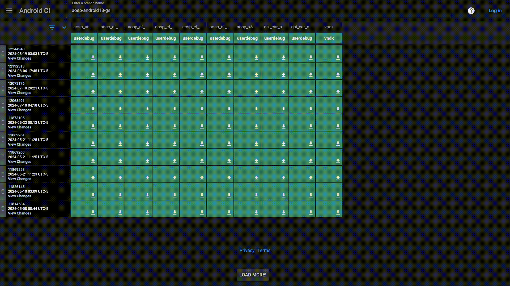
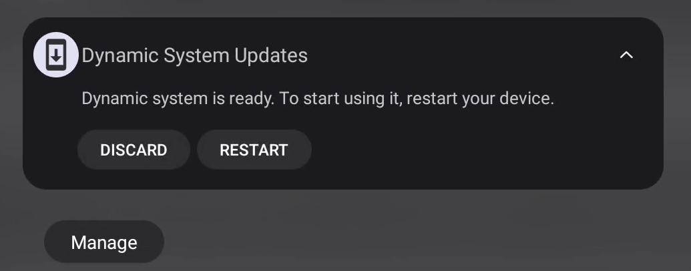
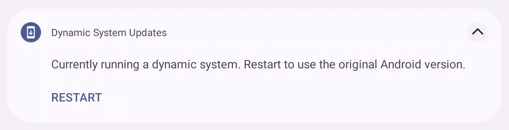

# How to pull boot partition off an Android device

## Table of Contents
- [Prerequisites](#prerequisites)
- [Boot into GSI](#boot-into-gsi)
- [Pull boot image](#pull-boot-image)

## Prerequisites
- PC requirements
    - ADB
        - Windows `winget install Google.PlatformTools`
        - Debian-based `sudo apt install adb -y`
- Android Device requirements
    - Unlocked bootloader
    - Supports Project Treble
        - Use [Treble Info](https://github.com/kevintresuelo/treble) to check your device.
    - [DSU Sideloader](https://github.com/VegaBobo/DSU-Sideloader) to load a generic system image (GSI) using a dynamic system update (DSU).

## Boot into GSI
If the prerequisites are met, download a userdebug GSI for your device. Choose a GSI appropriate for your device from [Phusson's GSI list](https://github.com/phhusson/treble_experimentations/wiki/Generic-System-Image-%28GSI%29-list). The test device used in this guide is Android 13, so the GSI chosen will the [official Google Android 13 GSI](https://ci.android.com/builds/branches/aosp-android13-gsi/grid?). Choose the target `aosp_arm64-userdebug` and download the `aosp_arm64-img-<date-of-build>.zip` from the Artifacts page (if your device is also Android 13).



If you downloaded on PC, then push the file to the device's download folder with (download path may vary):
```
adb push gsi.zip /sdcard/Download/
```
From here, you need to use the DSU Sideloader app to start the DSU activity.


You should then execute the command given by DSU Sideloader. In this case:
```
adb shell sh "/storage/emulated/0/Android/data/vegabobo.dsusideloader/files/install"
```
The DSU activity will show up in the notification panel.



The device will reboot and you should be greeted with the GSI you downloaded.

## Pull boot image
To pull the boot image, we need to find the boot partition of the device. If the device is an [A/B device](https://source.android.com/docs/core/ota/ab), then there may be two boot partitions, in which case you should pull both.

Enable adb root and verify you are running as root:
```
> adb root
restarting adbd as root
> adb shell
generic_arm64:/ # whoami
root
```
See which slot you are using:
```
generic_arm64:/ # getprop | grep slot
[cache_key.telephony.get_slot_index]: [4367607590848824471]
[ro.boot.slot_suffix]: [_b]
generic_arm64:/ #
```
In this case, the device is using slot b so we should be looking for a boot_b partition. Navigate to `/dev/`, and look around for what should be the boot partition. This is device specific, so look around for the right partition (or partitions).
```
generic_arm64:/ # cd /dev/
generic_arm64:/dev # find -iname "*boot*"
...
./block/bootdevice
./block/by-name/boot_a
./block/by-name/boot_b
...
```
In this case we can see that there is a directory called `by-name` which names the specific partition we are interested in. We can now directly pull these into our PC with `adb pull`. You can also go ahead and pull any other partitions if you want.
```
> adb pull /dev/block/by-name/boot_a ./boot_a.img
/dev/block/by-name/boot_a: 1 file pulled, 0 skipped. 151.5 MB/s (100663296 bytes in 0.633s)
> adb pull /dev/block/by-name/boot_b ./boot_b.img
/dev/block/by-name/boot_b: 1 file pulled, 0 skipped. 149.7 MB/s (100663296 bytes in 0.641s)
```
Exit out of the DSU using the notification.



You can then push the boot.img(s) back onto the device once stock ROM is back after reboot, and verify the file type.
```
> adb push boot_b.img /sdcard/Download/
boot_b.img: 1 file pushed, 0 skipped. 169.0 MB/s (100663296 bytes in 0.568s)
> adb shell file /sdcard/Download/boot_b.img
/sdcard/Download/boot_b.img: Android boot image v2
```
End of guide